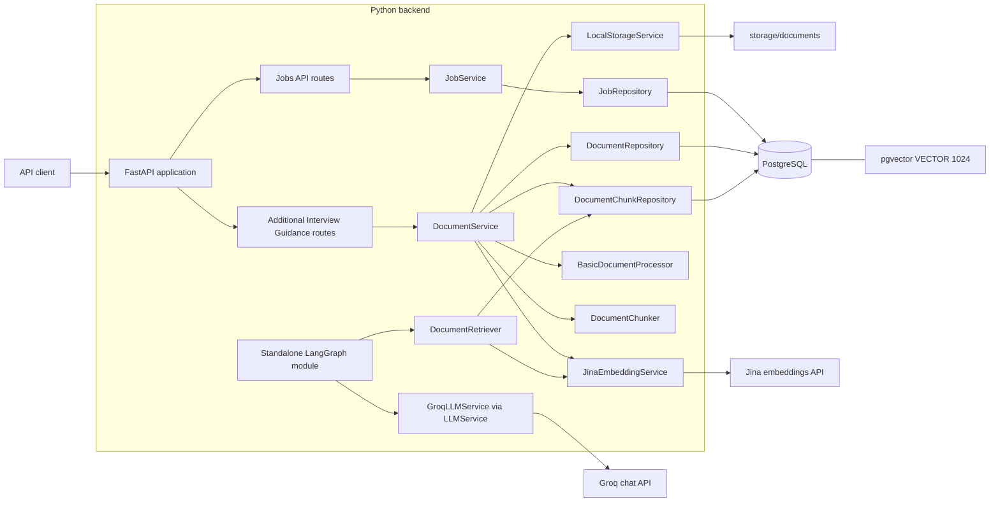
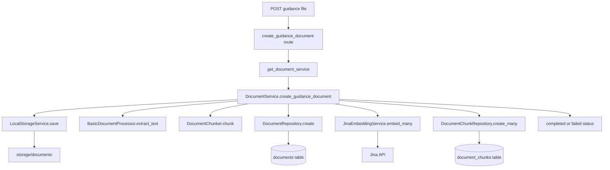
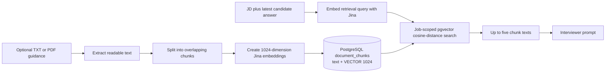
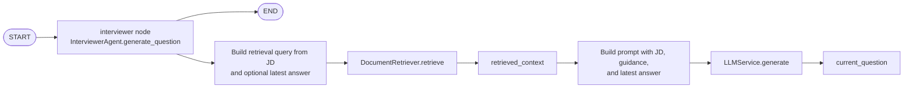
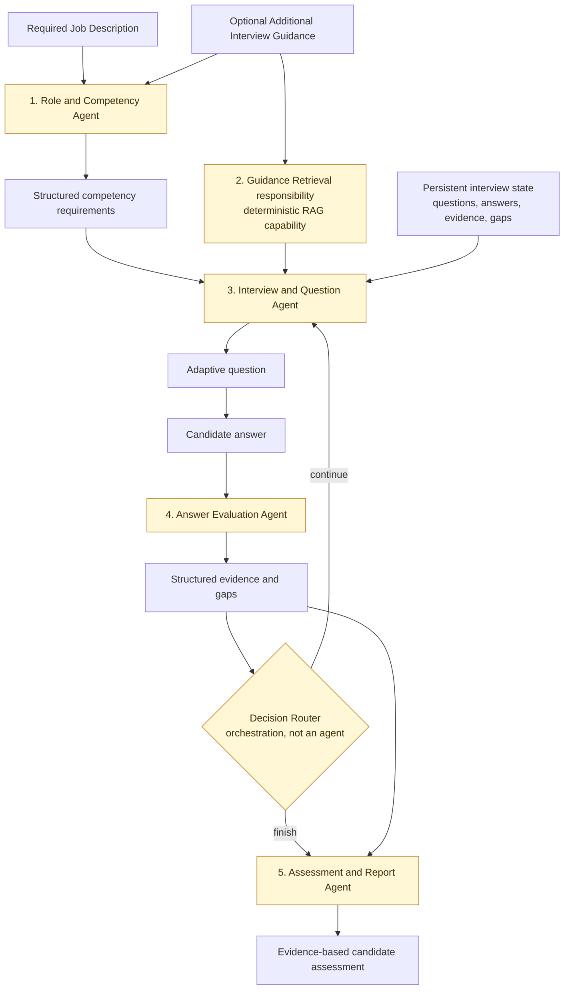

# TalentScout: Implemented Architecture

This document describes the code that exists today. It deliberately separates the current backend foundation from the future adaptive-interview design.

## 1. What the system currently does

TalentScout currently provides a FastAPI backend that can:

- create and retrieve hiring jobs;
- accept optional **Additional Interview Guidance** files for a job;
- extract text from TXT and PDF files, split it into chunks, embed those chunks with Jina, and store them in PostgreSQL/pgvector;
- semantically retrieve guidance chunks for a job; and
- define a small LangGraph workflow that uses retrieved guidance plus a Job Description and latest answer to generate one question through Groq.

It does **not** yet expose interview execution through the API, persist interview sessions/answers, evaluate answers, route interview decisions, or generate a candidate report.

## 2. Overall system architecture - CURRENT



Important: `Graph` is implemented as a module, but `api/main.py` does not construct it or expose an interview endpoint yet.

## 3. Major folders and modules

| Path | Responsibility |
| --- | --- |
| `backend/src/talentscout/api/` | FastAPI application factory and health endpoint. |
| `backend/src/talentscout/jobs/api/` | HTTP endpoints for jobs and Additional Interview Guidance. |
| `backend/src/talentscout/jobs/services/` | Application logic that coordinates repositories and deterministic processing services. |
| `backend/src/talentscout/jobs/repositories/` | SQLAlchemy database queries and persistence operations. |
| `backend/src/talentscout/jobs/schemas/` | Pydantic input/output contracts for the API. |
| `backend/src/talentscout/db/` | Async SQLAlchemy engine/session setup and ORM models. |
| `backend/src/talentscout/documents/` | Extraction interface/implementation, chunking, and vector retrieval. |
| `backend/src/talentscout/embeddings/` | Embedding abstraction and Jina implementation. |
| `backend/src/talentscout/llm/` | LLM abstraction and Groq implementation. |
| `backend/src/talentscout/agents/` | Current `InterviewState` and one-node LangGraph workflow. |
| `backend/src/talentscout/storage/` | Storage abstraction and local filesystem implementation. |
| `backend/src/talentscout/scripts/` | Re-embeds existing chunks that have no embedding. |
| `backend/migrations/` | Alembic history for jobs, documents, chunks, legacy context, and the 1024-vector dimension. |
| `backend/tests/` | Unit tests plus integration tests for PostgreSQL, Jina, pgvector, and API routes. |

## 4. Request/data flow

### Shared request path

```mermaid
sequenceDiagram
    participant C as Client
    participant R as FastAPI route
    participant S as Service
    participant Repo as Repository
    participant DB as PostgreSQL

    C->>R: HTTP request
    R->>R: Pydantic validation and dependency injection
    R->>S: application operation
    S->>Repo: persistence/query operation
    Repo->>DB: async SQLAlchemy query or flush
    DB-->>Repo: ORM data
    Repo-->>S: ORM data
    S-->>R: result
    R-->>C: Pydantic response
    Note over R,DB: get_session commits after a successful request;<br/>it rolls back if an exception escapes.
```

### Job creation, step by step

1. A client sends `POST /jobs` with `title` and `description`.
2. FastAPI validates the body as `JobCreate`. The schema has `extra="forbid"`, so `company_context` and other unknown inputs are rejected.
3. `get_job_service` creates `JobRepository` with the async request session.
4. `JobService.create_job` creates a `Job` ORM object.
5. `JobRepository.create` adds it to the session, flushes, refreshes, and returns it.
6. `get_session` commits after the endpoint returns successfully; FastAPI serializes `JobResponse`.

`GET /jobs/{job_id}` follows the same route -> service -> repository pattern. The repository executes a `SELECT`; the route returns 404 if no job exists.

### Additional Interview Guidance request flow



1. The client uploads a file to `POST /jobs/{job_id}/additional-interview-guidance`.
2. The route builds concrete dependencies: local storage, basic processor, chunker, document repositories, and Jina embedder.
3. `LocalStorageService` writes the original bytes under a generated UUID-based filename, preserving the original extension.
4. `BasicDocumentProcessor` reads UTF-8 plain text or extracts PDF page text using `pypdf`.
5. `DocumentChunker` makes overlapping character chunks: 1,000 characters with a 150-character overlap.
6. A `Document` row is created with status `processing`.
7. Each chunk is embedded, then `DocumentChunk` rows are written with their text, index, and vector.
8. The document becomes `completed` only after chunk embedding/storage succeeds. Handled decoding, processing, embedding, and HTTP failures result in `failed`.

The route itself does not first fetch the job. The database foreign key from `documents.job_id` to `jobs.id` is the relationship constraint when the document is persisted.

## 5. Additional Interview Guidance RAG pipeline - CURRENT



`DocumentRetriever.retrieve(job_id, query, limit=5)` is the retrieval capability. It rejects blank queries, embeds the query through `EmbeddingService`, then asks `DocumentChunkRepository.search` for the closest chunks belonging to that job. The repository joins a chunk to its document, filters by `document.job_id`, and orders by `embedding.cosine_distance(...)`.

This is RAG: retrieved source text is inserted into the question-generation prompt instead of expecting the LLM to know private company guidance on its own.

## 6. Current LangGraph flow - CURRENT



`build_interview_graph` creates exactly one node named `interviewer` and two edges: `START -> interviewer -> END`.

The node reads `InterviewState`:

- `job_id`
- `job_description`
- optional `candidate_answer` (only the latest answer)
- writes `retrieved_context`
- writes `current_question`

The node calls `DocumentRetriever` directly, then calls whichever `LLMService` implementation is injected. `GroqLLMService` is the provided implementation. There is no branching, session persistence, answer evaluation, or report generation in this graph.

## 7. Important component map

| File | Class / important functions | Responsibility | Main dependencies |
| --- | --- | --- | --- |
| `api/main.py` | `create_app`, `app` | Creates FastAPI and registers health, jobs, and guidance routers. | `Settings`, three routers. |
| `jobs/api/routes.py` | `create_job`, `get_job`, `get_job_service` | Job HTTP contract and 404 handling. | FastAPI DI, `JobService`, `JobCreate`, `JobResponse`. |
| `jobs/services/job.py` | `JobService.create_job`, `get_job` | Small application layer for jobs. | `JobRepository`, `Job` model. |
| `jobs/repositories/job.py` | `JobRepository.create`, `get_by_id` | SQLAlchemy persistence and lookup for `jobs`. | `AsyncSession`, `Job`. |
| `jobs/api/documents.py` | `get_document_service`, create/list/get guidance functions | Guidance HTTP contract and concrete dependency assembly. | `DocumentService`, storage, processor, chunker, repositories, Jina. |
| `jobs/services/document.py` | `DocumentService.create_guidance_document`, `reembed_missing_chunks` | Coordinates the upload-processing pipeline and document status. | Storage, processor, chunker, repositories, `EmbeddingService`. |
| `jobs/repositories/document.py` | `DocumentRepository` | Creates, reads, updates, and lists document metadata. | `AsyncSession`, `Document`. |
| `jobs/repositories/document_chunk.py` | `create_many`, `list_without_embeddings`, `search` | Stores chunks and performs job-scoped vector search. | `AsyncSession`, `DocumentChunk`, pgvector SQLAlchemy support. |
| `documents/processors/basic.py` | `BasicDocumentProcessor.extract_text` | Extracts text from TXT/PDF uploads. | `pypdf`, `DocumentProcessor`. |
| `documents/chunker.py` | `DocumentChunker.chunk` | Deterministically creates overlapping text chunks. | No external service. |
| `documents/retriever.py` | `DocumentRetriever.retrieve` | Turns a query into a vector search and returns chunks. | `EmbeddingService`, `DocumentChunkRepository`. |
| `embeddings/service.py`, `embeddings/jina.py` | `EmbeddingService`; `JinaEmbeddingService.embed` | Provider abstraction and Jina HTTP implementation; validates dimension. | `httpx`, settings, Jina API. |
| `llm/service.py`, `llm/groq.py` | `LLMService`; `GroqLLMService.generate` | Provider abstraction and Groq question-generation implementation. | `AsyncGroq`, settings. |
| `agents/state.py`, `agents/graph.py` | `InterviewState`; `InterviewerAgent.generate_question`; `build_interview_graph` | Defines the current one-node LangGraph question flow. | LangGraph, `DocumentRetriever`, `LLMService`. |
| `db/session.py` | `create_engine`, `get_session` | Async engine, session factory, commit/rollback lifecycle. | SQLAlchemy async, `Settings`. |
| `db/models/*.py` | `Job`, `Document`, `DocumentChunk` | Maps the three persisted concepts to database tables. | SQLAlchemy ORM, pgvector for chunk embeddings. |
| `storage/local.py` | `LocalStorageService.save`, `delete` | Development/local file storage implementation. | `pathlib`, `StorageService`. |

## 8. Technical concepts demonstrated

### FastAPI and Pydantic

FastAPI maps HTTP endpoints to async Python functions. Pydantic schemas validate input and serialize output. Dependency injection provides request-scoped services and database sessions without constructing them in every endpoint.

### Async SQLAlchemy, repositories, and services

`AsyncSession` avoids blocking the event loop while the backend waits for PostgreSQL. Repositories contain SQLAlchemy access patterns; services coordinate business operations across repositories and other capabilities. This keeps API routes thin and makes components independently testable.

### Embeddings, pgvector, and RAG

An embedding is a numeric representation of text. Jina returns vectors with 1,024 dimensions, matching the `VECTOR(1024)` database column. pgvector compares vectors by cosine distance, which lets the system find semantically related guidance chunks even when wording differs.

RAG combines that retrieved text with an LLM prompt. Here, the retriever is deterministic code; it is a capability used by the interviewer rather than an unnecessary LLM agent.

### Provider abstractions

`EmbeddingService`, `LLMService`, `DocumentProcessor`, and `StorageService` are abstract interfaces. The current concrete providers are Jina, Groq, basic TXT/PDF processing, and local disk. This limits provider-specific code to small modules.

### LangGraph state

LangGraph is used to declare nodes, edges, and a shared state object. The current graph proves the integration pattern, but its state is not yet a complete persistent interview memory.

### Migrations and configuration

Alembic migrations describe database schema history. `Settings` loads validated configuration from `.env` using the `TALENTSCOUT_` prefix, including database URL, Jina key/model/dimensions, and Groq key/model.

## 9. Data model and API surface - CURRENT

| Stored model | Purpose | Key data |
| --- | --- | --- |
| `Job` / `jobs` | Hiring role being screened for. | UUID, title, required description, status, timestamps. |
| `Document` / `documents` | Optional Additional Interview Guidance file metadata. | Job FK, filename, MIME type, storage path, processing status. |
| `DocumentChunk` / `document_chunks` | Searchable text fragment. | Document FK, chunk index, text, optional `VECTOR(1024)` embedding. |

Implemented endpoints:

| Method | Path | Purpose |
| --- | --- | --- |
| `GET` | `/health` | Returns `{ "status": "ok" }`. |
| `POST` | `/jobs` | Creates a job from title and required Job Description. |
| `GET` | `/jobs/{job_id}` | Reads a job. |
| `POST` | `/jobs/{job_id}/additional-interview-guidance` | Uploads optional guidance. |
| `GET` | `/jobs/{job_id}/additional-interview-guidance` | Lists a job's guidance documents. |
| `GET` | `/jobs/{job_id}/additional-interview-guidance/{document_id}` | Reads one guidance document's metadata. |

## 10. Architectural decisions reflected in code

- **The Job Description is required.** `JobCreate` requires `description`, so every job has the baseline input for future competency reasoning.
- **Additional Interview Guidance is optional.** It is uploaded separately and is used for extra assessment priorities, not required to create a job.
- **No Short Company Context field.** New job requests reject unknown `company_context`. The physical historical database column remains mapped as `legacy_company_context` only to preserve existing data; the current API and graph do not use it.
- **RAG work is deterministic infrastructure.** Extraction, chunking, embeddings, storage, and vector search live in services/repositories rather than becoming artificial LLM agents.
- **Provider code is isolated.** Jina and Groq are behind interfaces, supporting a future provider change without rewriting services/agents.
- **Local storage is an implementation choice for the current stage.** `LocalStorageService` satisfies the storage interface; a future object-store provider can use the same interface.
- **The model is asynchronous end to end where external/database APIs are involved.** Routes, services, repositories, Jina HTTP calls, Groq calls, and SQLAlchemy sessions use async APIs.

## 11. FUTURE / PLANNED five-agent architecture

The following is the intended architecture, not the current implementation.



The target has five meaningful responsibilities. The retrieval responsibility should still use the deterministic RAG capability shown above; the decision router coordinates state transitions and should not be counted as a sixth agent.

## 12. Current versus future summary

| CURRENTLY IMPLEMENTED | PLANNED / FUTURE |
| --- | --- |
| Jobs, optional guidance uploads, local storage, TXT/PDF extraction, chunking, Jina embeddings, pgvector search. | Structured role/competency analysis. |
| One standalone LangGraph node that retrieves context and generates one free-form question. | Persistent interview sessions, question/answer history, and competency evidence. |
| Groq and Jina provider integrations behind basic interfaces. | Answer evaluation, adaptive decision routing, and evidence-based reporting. |
| API endpoints for jobs and guidance metadata. | API/UI flows for interviewing candidates and retrieving final assessments. |

When explaining the project today: describe it as a solid backend and RAG foundation with an initial question-generation graph, not as a completed multi-agent technical-screening platform.
